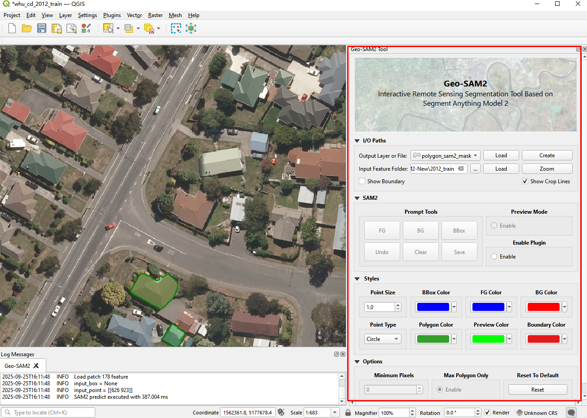

# <p align=center>Geo-SAM2: Interactive Remote Sensing Segmentation Tool Based on Segment Anything Model 2</p>
[](https://GitHub.com/Naereen/StrapDown.js/graphs/commit-activity) [](http://makeapullrequest.com) [](https://opensource.org/licenses/MIT)

# Contents
- [Introduction](#introduction)
- [Installation and Usage](#installation-and-usage)
- [Demo](#demo)
- [Highlights](#highlights)
- [Key Differences Between Geo-SAM2 and Geo-SAM](#key-differences-between-geo-sam2-and-geo-sam)
- [Notes](#notes)
- [Citation](#citation)
- [Acknowledgement](#acknowledgement)


## Introduction

**Geo-SAM2** is the QGIS plugin for interactive geospatial image segmentation, developed by [wenhwu](https://github.com/wenhwu) and [wm-Githuber](https://github.com/wm-Githuber), and built upon the [Segment Anything Model 2 (SAM2)](https://github.com/facebookresearch/sam2) architecture. Like its predecessor [**Geo-SAM**](https://github.com/coolzhao/Geo-SAM), it decouples the computationally intensive image encoding step from the lightweight prompt-based inference, enabling real-time or near real-time segmentation even on modest hardware.

However, Geo-SAM2 leverages the [Hiera](https://arxiv.org/abs/2306.00989) backbone of SAM2, which provides enhanced feature representation, multi-scale high-resolution features, and improved mask quality—especially for complex or fine-grained landforms in remote sensing imagery.

The plugin retains the two-part workflow:
1. **Image Encoding Part**: Preprocesses and saves SAM2 image features (including `image_embed` and `high_res_feats`) to disk.
2. **Interactive Segmentation Part**: Loads precomputed features for millisecond-level interactive segmentation using points, bounding boxes, or preview mode.

|  |
|:--:|
| *Geo-SAM2 UI.* |


## Installation and Usage

- Official Documentation:
  - [How to install and use?](docs\Installation_and_Usage.md)
- Tutorials from Geo-SAMs:
  - Referencing Geo-SAM usage, such as: [Segment Anything in QGIS with the Geo-SAM Plugin](https://www.youtube.com/embed/GSKmK7qERUw) - A comprehensive introduction video made by [Prof. Hans van der Kwast](https://www.qwast-gis.com/)


## Demo

<p align="center">
  
</p>


## Highlights

- ✅ **Powered by SAM2**: Utilizes the state-of-the-art SAM2 model with Hiera backbone for superior segmentation accuracy.
- ⚡ **Real-Time Interaction**: Millisecond-level inference using precomputed features.
- 🧩 **Multi-Scale Feature Support**: Leverages both `image_embed` and `high_res_feats` from SAM2 for detailed mask generation.
- 🖼️ **Large Image Support**: Automatically splits large rasters into 1024×1024 patches with edge-adaptive cropping to avoid boundary artifacts.
- 🌍 **Geospatial-Aware**: Fully integrated with QGIS CRS, extent, and raster handling.
- 🎨 **Flexible Input**: Supports 1–3 band inputs (grayscale, RGB, spectral indices, SAR, etc.), automatically broadcasted to 3 channels.

## Key Differences Between Geo-SAM2 and Geo-SAM

| Feature | **Geo-SAM** | **Geo-SAM2** |
|--------|-------------|--------------|
| **UI Design**         | Integrated into the QGIS top toolbar; some buttons require switching toolbars to access. | Integrated into the QGIS sidebar; all buttons are immediately visible with an optimized layout. |
| **Cropping Strategy** | Employs Encoder Copilot to assist in selecting cropping strategies. | Uses a non-overlapping cropping strategy; users can visualize crop boundaries in real time to support interactive refinement. |
| **Underlying Model**  | Segment Anything Model (SAM) with Vision Transformer (ViT) backbone. | Segment Anything Model 2 (SAM2) with Hiera backbone.                    |
| **Sampling Strategy** | Leverages *torchgeo* samplers with configurable overlapping strides. | Employs a non-overlapping, edge-adaptive GDAL-based sliding window approach (fixed 1024×1024 patches). |

>**Summary**: Geo-SAM2 represents not merely an incremental update but a fundamental enhancement over Geo-SAM,offering significant improvements in user interface design, model capacity, functional richness, and robustness for geospatial applications, while preserving the intuitive QGIS integration and real-time interactive workflow.

## Notes

- SAM2, like SAM, is designed to **segment one object per prompt session**. Save results before starting a new segmentation.
- Input rasters with **1 or 2 bands** are automatically replicated to 3 channels (e.g., `[B1] → [B1, B1, B1]`).
- Geo-SAM2 currently **requires CUDA** for the segmentation stage (CPU fallback not implemented in the provided code).
- This plugin is under active development. Feedback and contributions are welcome!

## Citation

If you find this project useful in your research, please consider citing:

```bibtex

@misc{Geo_SAM2_2025,
    title={Geo-SAM2: Interactive Remote Sensing Segmentation Tool Based on Segment Anything Model 2},
    author={Wu, Wenhui and Wang, Mengmeng},
    howpublished = {\url{https://github.com/wenhwu/Geo-SAM2}},
    year={2025}
}

@software{zhao_zhuoyi_2023_8191039,
  author       = {Zhao, Zhuoyi and Fan, Chengyan and Liu, Lin},
  title        = {{Geo SAM: A QGIS plugin using Segment Anything Model (SAM) to accelerate geospatial image segmentation}},
  month        = jul,
  year         = 2023,
  publisher    = {Zenodo},
  version      = {1.1.0},
  doi          = {10.5281/zenodo.8191039},
  url          = {https://doi.org/10.5281/zenodo.8191039}
}
```

## Acknowledgement

This work builds upon:
- [Geo-SAM](https://github.com/coolzhao/Geo-SAM) by [Zhuoyi Zhao](https://github.com/coolzhao/) and [Chengyan Fan](https://github.com/Fanchengyan) from [Cryosphere Lab](https://cryocuhk.github.io/), ESSC, CUHK;
- [SAM](https://github.com/facebookresearch/segment-anything) and [SAM2](https://github.com/facebookresearch/sam2) by Meta AI;
- [QGIS](https://github.com/qgis/QGIS) for the powerful, open-source GIS platform.

We thank the developers of these projects for their foundational contributions.
