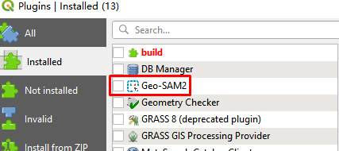
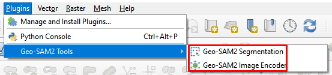
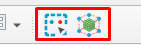

# Installation and Usage

**Note:** The following installation and usage instructions are specifically for the `Windows` operating system. Compatibility with other operating systems has not been verified at this time.

## Contents

- [Installation](#installation)
  - [Install QGIS](#install-qgis)
  - [Download the Geo-SAM2 Plugin](#download-the-geo-sam2-plugin)
  - [Configure the Plugin Folder](#configure-the-plugin-folder)
  - [Activate the Geo-SAM2 Plugin](#activate-the-geo-sam2-plugin)
- [Usage](#usage)
  - [Geo-SAM2 Image Encoder](#geo-sam2-image-encoder)
    - [Download SAM2 Checkpoints](#download-sam2-checkpoints)
    - [Running the Geo-SAM2 Image Encoder](#running-the-geo-sam2-image-encoder)
  - [Geo-SAM2 Interactive Segmentation](#geo-sam2-interactive-segmentation)


## Installation

This section provides a step-by-step guide for installing the Geo-SAM2 plugin for QGIS. Proper installation is crucial for the plugin to function correctly.

### Install QGIS

First, it is necessary to download and install the QGIS software. You can obtain the installer from the official QGIS website: [https://qgis.org/download/](https://qgis.org/download/).

**Version Requirement:** The installed version of QGIS must be `3.40.11` or higher. It is highly recommended to use the **Long Term Release (LTR)** version, specifically `3.40 LTR for Windows`. The LTR version provides enhanced stability and long-term support, which is ideal for academic and professional work.

### Download the Geo-SAM2 Plugin

The plugin can be downloaded directly from its official GitHub repository: [https://github.com/wenhwu/Geo-SAM2](https://github.com/wenhwu/Geo-SAM2).

On the GitHub page, locate the "Source code" (usually in a compressed format like `.zip`) and download it. After downloading, decompress the file and rename the resulting folder to `Geo-SAM2`.

### Configure the Plugin Folder

Once the plugin is downloaded and the folder is correctly named, you must place the entire `Geo-SAM2` folder into the QGIS `plugins` directory (like `C:/Users/xxx/AppData/Roaming/QGIS/QGIS3/profiles/default/python/plugins/Geo-SAM2`). The correct directory structure should be as follows:

```
    python
    └── plugins
        └── Geo-SAM2
            ├── checkpoint
            ├── docs
            ├── ...
            ├── tools
            └── ui
```

**Note**:

1.  **Folder Naming:** It is critical to rename the folder to `Geo-SAM2` after decompression. The plugin will not be recognized by QGIS if the folder name is incorrect (e.g., `Geo-SAM2-main`).
2.  **Avoid Nested Folders:** Be cautious of nested folders that can be created during decompression. An incorrect structure like `plugins/Geo-SAM2/Geo-SAM2/...` will prevent the plugin from loading. If this occurs, you must move the inner `Geo-SAM2` folder into the `plugins` directory.

### Activate the Geo-SAM2 Plugin

After placing the plugin in the correct directory, restart QGIS to allow it to detect the new plugin.

1.  Navigate to the menu: `Plugins` \> `Manage and Install Plugins`.
2.  In the `Installed` tab, you should now see the `Geo-SAM2` plugin listed.
3.  Check the box next to it to activate the plugin.



Once activated, the Geo-SAM2 tools will be accessible from the `Plugins` menu.



Additionally, a new toolbar with `two icons` for quick access to the Geo-SAM2 tools will appear in the QGIS interface.



## Usage

This section explains how to use the core functionalities of the Geo-SAM2 plugin.

### Geo-SAM2 Image Encoder

The Image Encoder is a preliminary step that processes the image to generate embeddings, which are necessary for the interactive segmentation tool.

#### Download SAM2 Checkpoints

Before using the encoder, you must download the pre-trained model checkpoints. These checkpoints are essential as they contain the learned weights of the SAM2 model. Download the following files and place them in the `./plugins/Geo-SAM2/checkpoints` directory:

  - [sam2.1\_hiera\_large.pt](https://dl.fbaipublicfiles.com/segment_anything_2/092824/sam2.1_hiera_large.pt)
  - [sam2.1\_hiera\_tiny.pt](https://dl.fbaipublicfiles.com/segment_anything_2/092824/sam2.1_hiera_tiny.pt)

*Note: The `large` model provides higher accuracy but requires more computational resources, while the `tiny` model is faster and less resource-intensive.*

#### Running the Geo-SAM2 Image Encoder

The following animation shows the process of running the image encoder.

<p align="center">
  
</p>

Please note that in the current version, the `Stride` is fixed at `1024` and the `Batch size` is fixed at `1`. These parameters control how the image is processed, and future updates may allow for their customization.

### Geo-SAM2 Interactive Segmentation

The interactive segmentation tool allows for the precise selection and segmentation of objects within an image. It offers two distinct modes of operation:

  - **Preview Mode:** In this mode, as you move the mouse cursor over the image, the plugin provides a real-time segmentation preview. This is useful for quickly exploring and identifying objects.
  - **Non-Preview Mode:** This mode allows for more deliberate segmentation. The segmentation result is generated only after you click to place points or draw a bounding box around the desired object. This provides greater control and precision.

The animation below illustrates the interactive segmentation process, showcasing how to select objects within a large image.

<p align="center">
  
</p>
